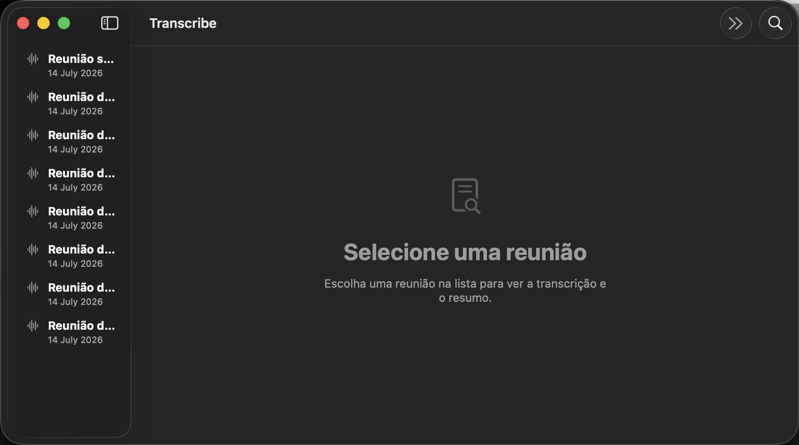

# Transcribe

> Transcrição de reuniões **100% on-device** para macOS — sem nuvem, sem contas, sem enviar seu áudio pra lugar nenhum.

App nativo de macOS (barra de menu + janela) que grava, transcreve e resume suas reuniões usando
os modelos locais da Apple. O áudio nunca sai do seu Mac e **nada é gravado em disco** — só o texto.



## ✨ Recursos

- 🎙️ **Transcrição ao vivo** — mistura seu microfone com o áudio do sistema (os outros participantes) e
  transcreve em tempo real, com medidor de nível e **pausar/retomar**.
- 🧠 **Resumo sob demanda** — gera um resumo em **tópicos ou prosa**, com itens de ação opcionais e um
  campo de **instruções em linguagem natural** pra direcionar o modelo. Salve suas configurações como
  **presets** (Daily, Call de vendas, 1:1…).
- ✅ **Itens de ação marcáveis** — vire as tarefas combinadas em checkboxes.
- 📅 **Integração com o Calendário** — sugere a gravação quando uma reunião com link de chamada está
  prestes a começar; opcionalmente **inicia e encerra sozinho** com base no evento.
- 📤 **Exportar/compartilhar** — copie como Markdown/texto ou exporte um `.md`.
- 🌐 **Idioma configurável** — padrão pt-BR, com os idiomas suportados pelo reconhecedor.
- 🔒 **Privado por construção** — transcrição via `SpeechAnalyzer`, resumo via `FoundationModels`
  (Apple Intelligence), captura de áudio do sistema via `ScreenCaptureKit`. Tudo local.

## 🖥️ Requisitos

- macOS **26+** em Apple Silicon
- Xcode 26+
- [XcodeGen](https://github.com/yonyz/XcodeGen) (`brew install xcodegen`)
- **Apple Intelligence ativado** para os resumos automáticos (a transcrição funciona sem)

## 🚀 Como rodar

```sh
xcodegen generate
open Transcribe.xcodeproj   # e rode (⌘R) pelo Xcode
```

Ou pela linha de comando:

```sh
xcodegen generate
xcodebuild -project Transcribe.xcodeproj -scheme Transcribe -configuration Debug \
  -allowProvisioningUpdates build
```

> O projeto é gerado a partir de `project.yml` (fonte da verdade). Defina seu `DEVELOPMENT_TEAM`
> lá — uma identidade de assinatura estável é necessária para que o macOS **não zere as permissões**
> a cada rebuild.

## 🔑 Permissões

O onboarding pede, uma por vez, as três permissões essenciais para gravar: **Microfone**,
**Reconhecimento de fala** e **Gravação de tela** (esta última é o que o macOS exige para capturar o
áudio do sistema, mesmo sem gravar vídeo).

O **Calendário é opcional** e aparece só depois das três essenciais. Dá para pular sem bloquear a
gravação; o Transcribe nunca abre esse prompt sozinho. Depois, a integração pode ser conectada pelo
aviso na lista de reuniões ou pelos Ajustes.

## 🗂️ Arquitetura

SwiftUI + XcodeGen. Estado central em `AppState` (máquina de estados Standby ↔ Meeting). Captura de
mic (`AVAudioEngine`) e de sistema (`ScreenCaptureKit`) alimentam o `Transcriber` (`SpeechAnalyzer`);
resumo pelo `Summarizer` (`FoundationModels`); reuniões salvas como JSON local por
`MeetingStore`. Detalhes e convenções em [`CLAUDE.md`](CLAUDE.md).

## 🧭 Roadmap

- Diarização (quem falou o quê)
- Exportar PDF; enviar direto pra e-mail/Slack
- Melhor vocabulário para nomes próprios e siglas

---

Feito com ☕ na [Orla](https://orla.tech).
